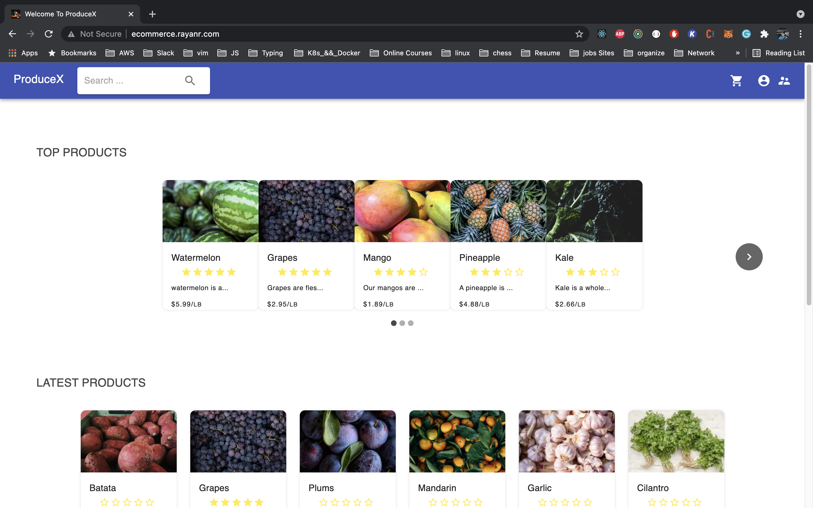
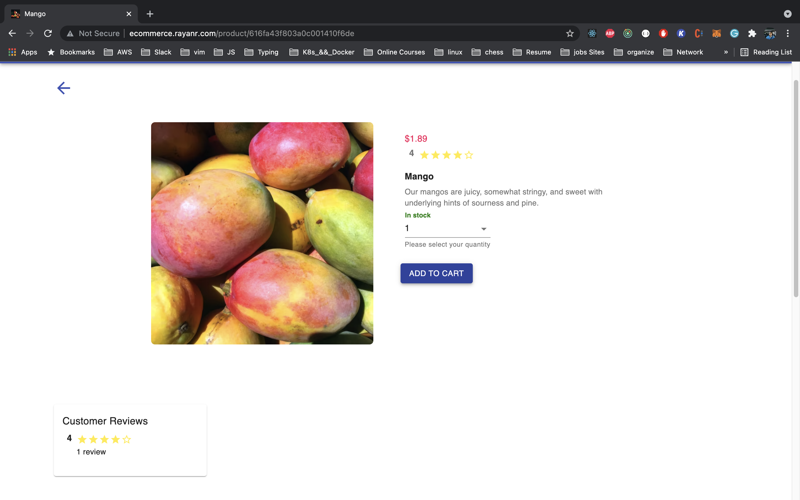
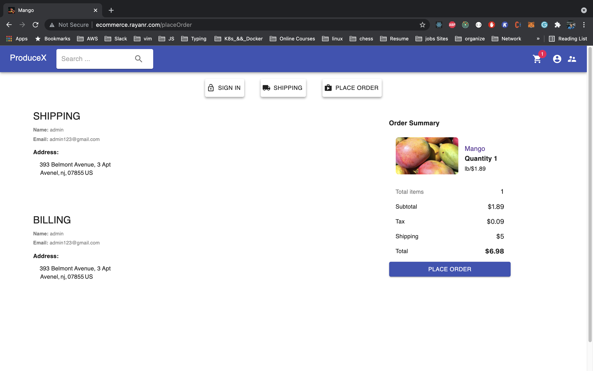
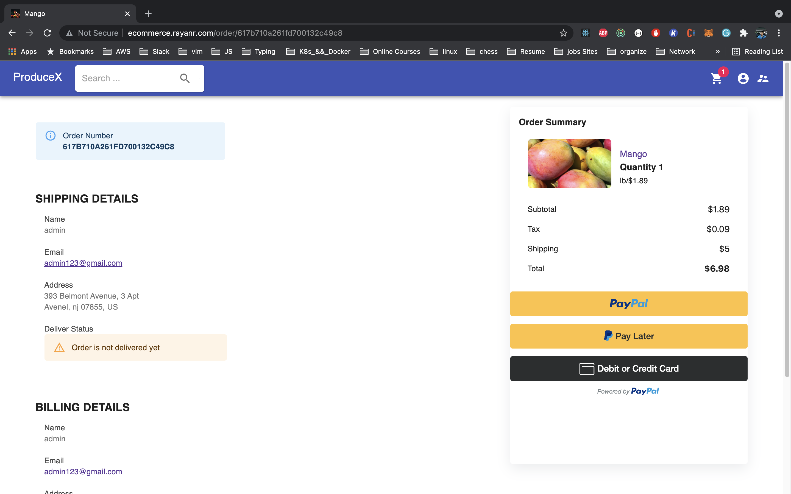
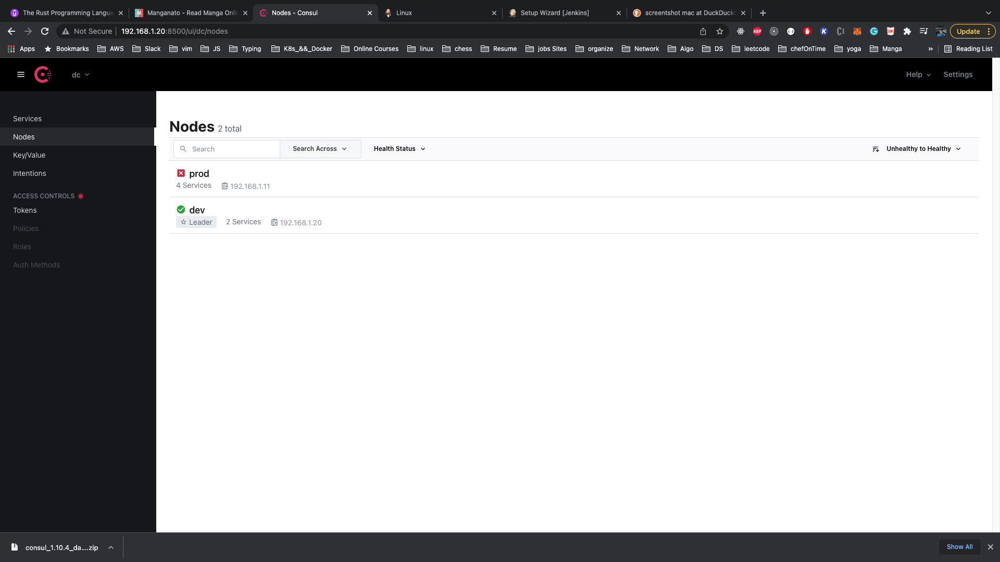
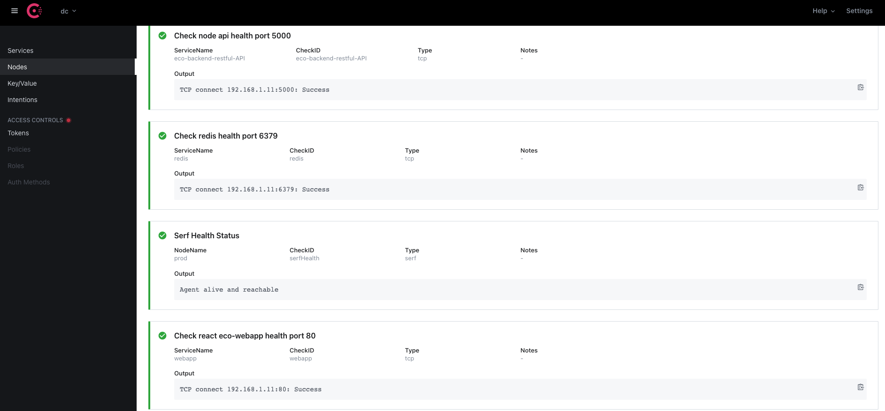

# ProduceX

An MERN e-commerce application with features such as login system, search product by name, shopping cart features, review, administration page, user management, rate, paypal payment. 

<p align="center">
  
  
  
  
  
  
  
  
</p>

# Hosted here 
 [here](http://ecommerce.rayanr.com)
# Installation

Use the package manager [npm](https://www.npmjs.com/) to install ProduceX.

```bash
npm i
```
## Admin Credentials
```bash
admin123@gmail.com
admin123
```
## User Credentials
```bash
user123@gmail.com
user123
```
## PayPal Credentials
```bash
sb-7dupl7258161@personal.example.com
KhFwVD/0
```
## Features 
 User | Admin product management
 -----|------
 Checkout process | user's features
 Database seeder | Admin user management
 login| update user to admin
 logout| delete user
 register| delete order
 rate and review the products| view users
 pay with paypal| mark orders as delivered option
 search products| 
 delete orders|
 view order | 
 update profile|
 shopping cart|

## Run backend server tests
```bash
cd backend && npm run test
```
## Working on Features
 User | Admin
 -----|------
 forgotpassword| reset user
 confirm registration|

## Dependecies
```
# create a .env in the root dir and add the following vars 
#########################
# ECOMMERNCE SETTINGS
##########################
#NODE_ENV=development
NODE_ENV=production
PORT=5000
MONGO_URL_PROD=MONGO_URL_PROD
MONGO_URL_TEST=MONGO_URL_TEST
JWT_TOKEN_SECRET=JWT_TOKEN_SECRET
PAYPAL_CLIENT_ID=PAYPAL_CLIENT_ID
AWS_BUCKET_IMAGES_NAME=producx-holds-images
AWS_BUCKET_REGION=us-east-1
AWS_ACCESS_KEY_ID=AWS_ACCESS_KEY_ID
AWS_SECRET_ACCESS_KEY=AWS_SECRET_ACCESS_KEY
PORT_S3=5001
```
## Usage

```bash
# to start the app
npm run dev
```

```bash
# to seed data 
npm run data:import
```
```bash
# to destroy data 
data:destroy
```

## Backend REST-API Documentation
 Postman documentation for the REST-API is available here:
 [Backend](https://github.com/rayan147/ecommerce/tree/master/backend)
## Contributing
Pull requests are welcome. For major changes, please open an issue first to discuss what you would like to change.

Please make sure to update tests as appropriate.

## License
[MIT](https://choosealicense.com/licenses/mit/)
